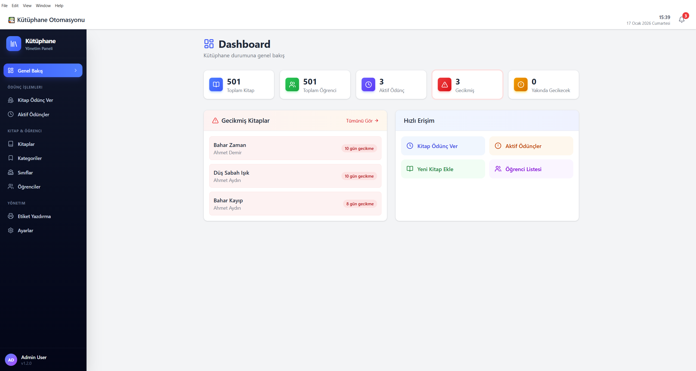
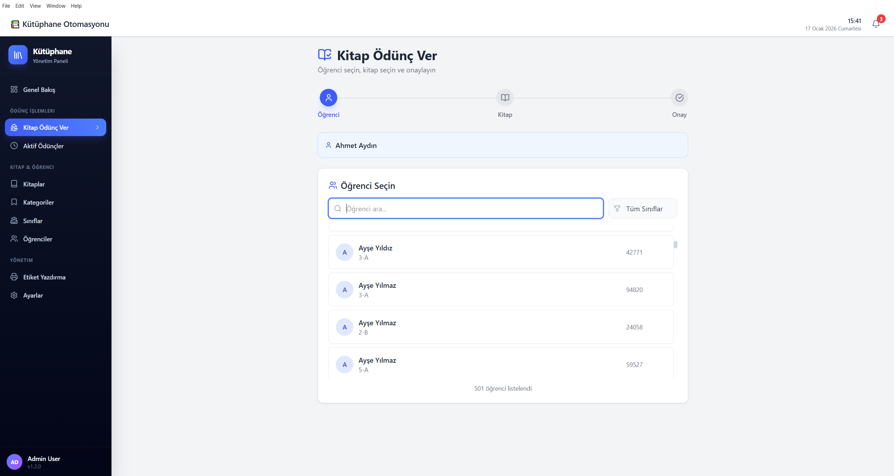
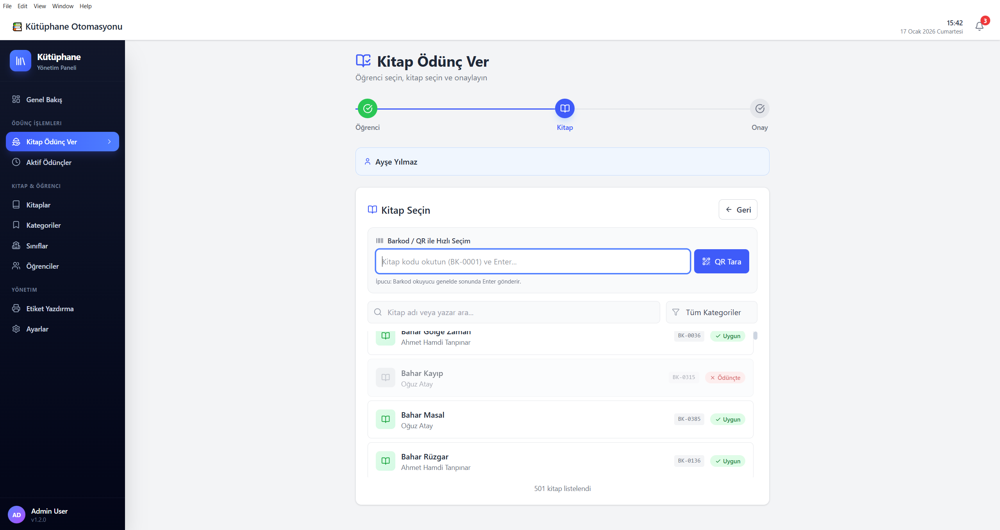
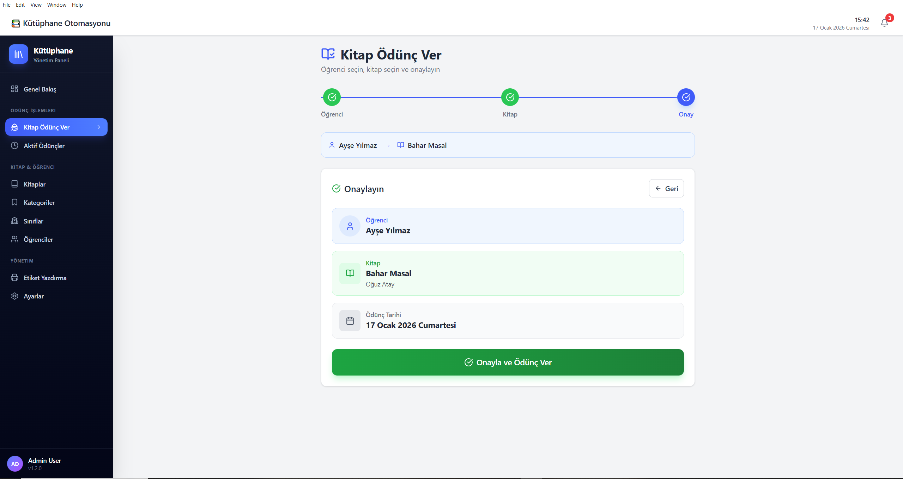
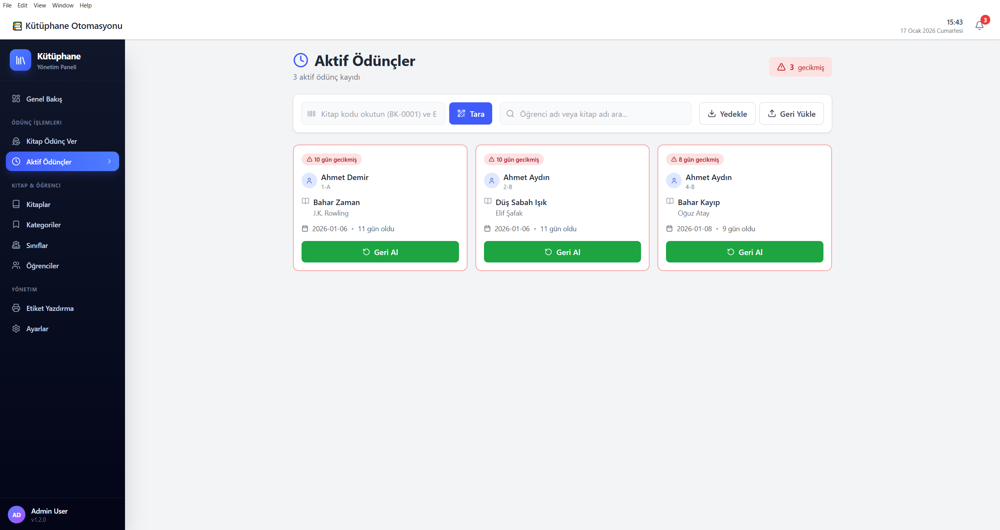
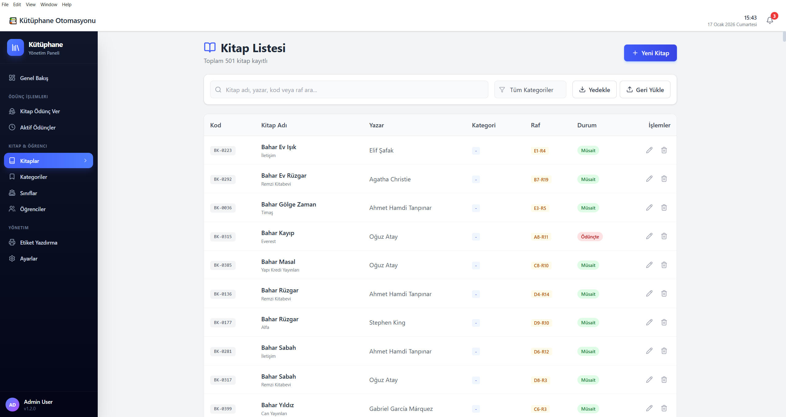
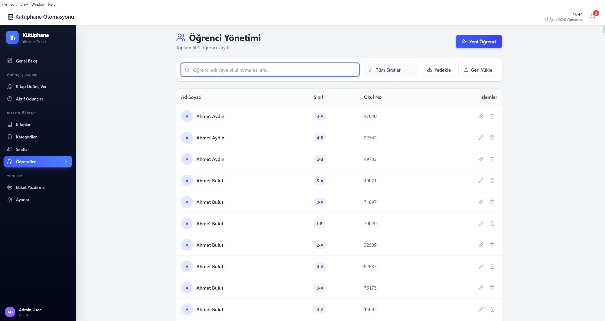
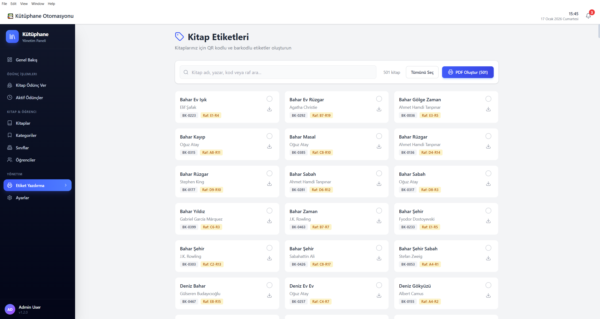
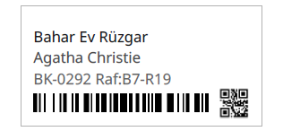
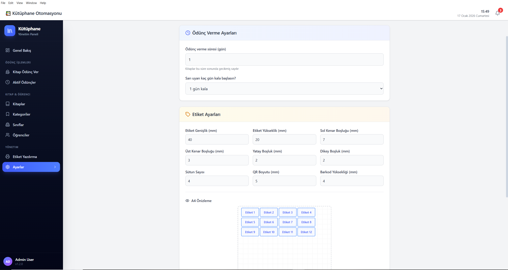

# 📚 Kütüphane Takip Sistemi

**Kütüphane kitap kayıtlarını** yönetmek ve kitaplar için **etiket/barkod/QR (PDF)** çıktıları üretmek için geliştirilmiş masaüstü uygulaması.

> Tech Stack: Electron + React (Vite) + TypeScript + TailwindCSS + SQLite
> Paketleme: electron-builder (Windows NSIS)

---

## ✨ Özellikler

* 📖 Kitap ekleme / düzenleme / silme
* 🔎 Hızlı arama ve listeleme
* 🏷️ Etiket / Barkod / QR üretimi (PDF)
* 🖨️ Yazdırmaya uygun çıktılar
* 💾 Yerel veritabanı (SQLite) ile offline çalışma
* 🧩 Modern arayüz (React + Tailwind) ve modüler yapı

---

## 🖼️ Ekran Görüntüleri

| #  | Ekran                   | Görsel                                               |
| -- | ----------------------- | ---------------------------------------------------- |
| 1  | Ana ekran               |                 |
| 2  | Ödünç verme – Adım 1    |          |
| 3  | Ödünç verme – Adım 2    |          |
| 4  | Ödünç verme – Adım 3    |          |
| 5  | Ödünç alınanlar listesi |       |
| 6  | Kitap listesi           |         |
| 7  | Öğrenci listesi         |    |
| 8  | Etiket yazdırma         |  |
| 9  | Etiket / Barkod / QR    |                   |
| 10 | Ayarlar                 |               |

---

## ✅ Gereksinimler

* Node.js (LTS önerilir)
* npm (projede scripts npm üstünden çalışıyor)

> İstersen yarn ile de çalıştırabilirsin ama mevcut scripts `npm run ...` kullandığı için npm en sorunsuz yol.

---

## 🚀 Kurulum ve Çalıştırma

### 1) Projeyi indir

```bash
git clone https://github.com/batinkasapoglu/kutuphane-takip-sistemi.git
```

### 2) Bağımlılıkları yükle

```bash
npm install
```

### 3) Geliştirme modunda çalıştır

Bu komut **React (Vite)** ve **Electron** süreçlerini aynı anda başlatır:

```bash
npm run dev
```

İstersen ayrı ayrı da çalıştırabilirsin:

```bash
npm run dev:react
npm run dev:electron
```

---

## 🧭 Kullanım 

### 1) İlk açılış

* Uygulamayı açtığında veriler **SQLite** veritabanına yazılır.
* İlk kullanımda veritabanı dosyası otomatik oluşur.

> Not: Veritabanı dosyasının tam konumu projedeki `dbPath` tanımına göre belirlenir (geliştirme/kurulu sürüm farklı olabilir).

### 2) Kitap ekleme

* “Kitap Ekle” butonuna tıkla
* Alanları doldur:

  * Kitap Adı
  * Yazar
  * Kod (barkod/enzersiz kod)
  * Raf Kodu (opsiyonel)
* Kaydet

### 3) Arama / Bulma

* Arama kutusuna kitap adı / yazar / kod yaz
* Liste filtrelenir

### 4) Etiket / Barkod / QR (PDF)

* Kitap detayından “Etiket” (veya ilgili menü) bölümüne gir
* Barkod/QR üret
* PDF olarak indir veya yazdır

### 5) Düzenleme / Silme

* Kitap satırındaki düzenle ile güncelle
* Sil ile kaldır

---

## 🏗️ Build / Paket Alma

### Web build (Vite + TS)

```bash
npm run build
```

### Windows kurulum dosyası (NSIS) üretme

Bu komut önce build alır, sonra `electron-builder` ile paketler:

```bash
npm run dist
```

Çıktılar şu klasöre düşer:

* `release/`

> Windows için ikon: `public/icon.ico`
> Installer: NSIS (oneClick kapalı, kurulum dizini seçilebilir, kısayol oluşturur)

---

## 🗂️ Proje Yapısı (Örnek)

> Klasör isimleri sende farklıysa güncelleyebilirsin.

```
electron/          # Electron main process dosyaları
src/               # React UI (Vite)
public/            # statik dosyalar (icon, font, vb.)
docs/images/       # README görselleri
release/           # dist çıktısı (git ignore önerilir)
```

---

## 🧯 Sık Karşılaşılan Sorunlar

### `npm run dev` açılıyor ama pencere gelmiyor

* `npm run dev:react` çalışıyor mu kontrol et (Vite portu ayakta mı?)
* Electron ana dosyan `electron/main.js` doğru mu?
* Konsolda hata varsa kopyalayıp issue açabilirsin

### `sqlite3` kurulum hatası (Windows)

* Node sürümünü LTS yap
* Temiz kurulum:

```bash
rm -rf node_modules package-lock.json
npm install
```

---

## 🛣️ Yol Haritası

* [ ] Dil desteği (TR/EN)
* [ ] İstatistik ekranı
* [ ] Çoklu kullanıcı / rol (opsiyonel)

---

## 📄 Lisans

MIT

---

## 👤 Geliştirici

* Batin Kasapoglu
